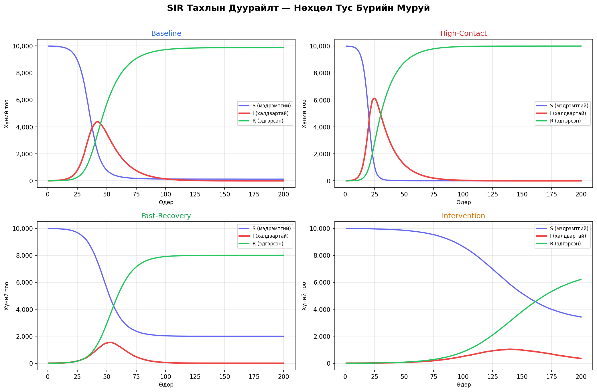
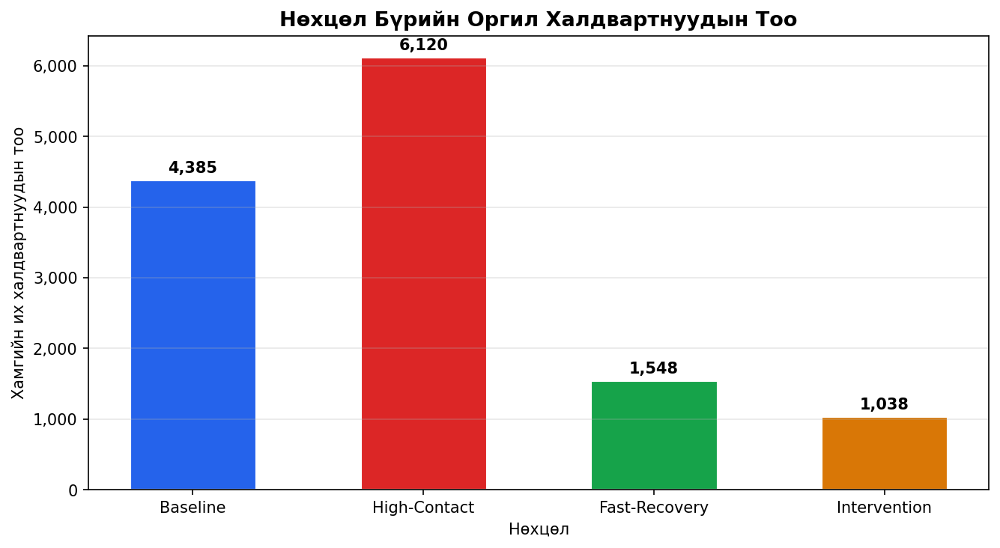

# SIR Тахлын Дуурайлт (Epidemic Simulation)

Энэ репозитор нь **SIR загвар** ашиглан тахлын тархалтыг компьютерт дуурайдаг жижиг Python төсөл юм.

---

## Загварын тухай

**SIR** гэдэг нь гурван төлөвийг илэрхийлнэ:

| Үсэг | Монголоор    | Утга                                   |
|------|-------------|----------------------------------------|
| **S** | Мэдрэмтгий  | Халдвар авч болзошгүй хүн               |
| **I** | Халдвартай  | Одоогоор өвчтэй, бусдад халдаах хүн    |
| **R** | Эдгэрсэн   | Эдгэрч, дархлаа олсон хүн              |

Томьёо:

```
dS/dt = -β · S · I / N
dI/dt = β · S · I / N - γ · I
dR/dt = γ · I
```

- **β** = халдварын дамжих хурд
- **γ** = эдгэрэх хурд
- **R₀ = β / γ** = нэг халдвартнаас халдвар авах дундаж хүний тоо

---

## Файлын бүтэц

```
epidemic-sim/
├── src/
│   ├── simulate.py   # SIR загварын үндсэн тооцоолол
│   └── plot.py       # Үр дүнг зурдаг модуль
├── outputs/          # Автоматаар үүснэ
│   ├── summary.json              # Хураангуй
│   ├── baseline_timeline.json    # Цувааны мэдээлэл
│   ├── sir_curves.png            # SIR муруйнуудын зураг
│   └── peak_comparison.png       # Оргил харьцуулах диаграм
├── run_all.sh        # Нэг командаар бүгдийг ажиллуулах
└── README.md         # Энэ файл
```

---

## Ажиллуулах заавар

### Шаардлага

```bash
python --version   # Python 3.9 буюу түүнээс дээш
pip install numpy matplotlib
```

### Бүгдийг нэг командаар

```bash
cd epidemic-sim
bash run_all.sh
```

### Тусад тусад

```bash
cd epidemic-sim
python src/simulate.py   # зөвхөн тооцоолол
python src/plot.py       # зөвхөн зураг
```

---

## Нөхцөлүүд

| Нөхцөл        | β    | γ    | Тайлбар                  |
|---------------|------|------|--------------------------|
| Baseline      | 0.30 | 0.07 | Ердийн тархалт            |
| High-Contact  | 0.50 | 0.07 | Их нийгмийн холбоо        |
| Fast-Recovery | 0.30 | 0.15 | Хурдан эдгэрэх эмчилгээ  |
| Intervention  | 0.12 | 0.07 | Хөл хорио хэрэгжүүлсэн   |

---

## Гаралт

`outputs/` хавтасаас дараахь файлуудыг харна уу:
- **summary.json** - нөхцөл бүрийн хураангуй тоо баримт
- **sir_curves.png** - 4 нөхцлийн S/I/R муруйнуудын зураг
- **peak_comparison.png** - оргил халдвартнуудын харьцуулалт

---

*Энэ нь сургалтын зорилготой жишээ загвар бөгөөд бодит эрүүл мэндийн зөвлөмж биш.*
## Results

### SIR Curves


### Peak Comparison

